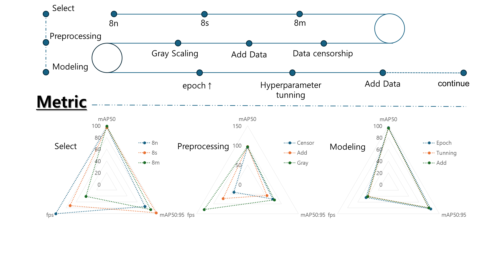

"# Drone" 
# Summary

1.  Model 선택 → YOLO8m
2. 전처리 : Gray Scaling 이 가장 효과있음
3. Model tunning에 있어 성능향상 부분은 없었음.

# 기획 의도

우크라이나-러시아 전쟁을 보며 Drone의 중요성을 인지 

→  자폭용 드론을 만들어, 향 후 북한과의 전쟁에서 활용

# 문제현황

- 현 시점에서 드론 격추하는 무기는 머싱건, 레이저, 미사일임
- 이들은 모두 비쌈, 휴대하기 어려움, 수동조작임

# Dataset

- 새(753), 드론(1253), 헬기(1116), 이동형드론(1171)
- Roboflow에서 다운받음
    - https://app.roboflow.com/ds/28liIAkWiN?key=6Qrz2eATSn

# Model 선택

- Drone 추적은 시간이 생명
- Metric : fps(detect 시간), mAP (정확도)
- 추론시간 대비 정확도가 좋은 Yolo선택
- Yolo 8n, Yolo 8s, Yolo8m 비교

## 결과

| Model |  | 8n | 8s | 8m |
| --- | --- | --- | --- | --- |
| mAP50 | IoU ≥ 0.5에서만 AP를 계산 | 0.97 | 0.97 | 0.99 |
| mAP50:95 |  IoU를 0.5에서 0.95까지 다양한 기준으로 평가
→ 모델의 전체적인 탐지능력을 더 잘 반영함. | 0.75 | 0.97 | 0.98 |
| fps | 모델이 초당 처리할 수 있는 **프레임(이미지) 수** | 100 | 71 | 40 |
- 수치 상 성능은 모두 괜찮아 보임

https://youtu.be/Af4Bkwsjk9Y?si=b9Y_WqdjKntOngel

https://youtu.be/3OHysmQDkMo?si=Qt3IdfPhC1ua6NeQ

https://youtu.be/ggDVaY9Rwd8?si=ZnSWbsS8C8UYHvTu

- 결과 : 8m >> 8s > 8n
- model 이 복잡할수록 인식을 더 잘하는 것 같음
- 8n, 8s의 경우 잘 drone인식을 잘 못함
    - (비슷한 모형의 헬리콥터가 아닌, 이동형 드론으로 인식하는 경우도 있음)
- Drone을 helicopter로 인식하는 경우가 많음
    - 프로펠라가 있을 때, 작은물체는 helicopter, 큰물체는 Drone으로 인식.
- 여자 머릿결을 bird로 인식함

# 성능up전략

## 1. 전 처리 단계

### 1-1. 데이터 검열(Yolo8m 사용)

- Drone을 helicopter로 인식하는 경우에서 생각함
- 학습한 data를 보니, Drone을 가까이 촬영하고, helicopter를 멀리서 촬영한 경우가 있음
- 잘못 인식하는 경우도 많았기 때문에 흐릿한 data는 모두 삭제
- 새 (-150), 드론(-100), 헬리콥터(-200)
- 결과 - 별차이 없음 (헬리콥터 드론 구분을 못함)

https://youtu.be/iOF9qp0KJUc?si=QOSbiEzApc7RwUt6

### 1-2. 작은 SIZE이미지, 군집 이미지DATA 추가

- 새(+350), 드론(+200), 이동형드론(+200)
- 결과 - 조금의 성능향상

https://youtu.be/H23Qeg6Q7kY?si=LM2wfbtxgJG_YAkg

### 1-3. Gray scaling

- (새,드론,이동형드론,헬리콥터) *2
- 결과 - 성능이 눈에 띄게 좋아짐
    - **배경이 문제인 것 같음**
    
    
    
    - 

https://youtu.be/fJf6gYzBWyE

---

### 1-4. Augmentation (Albumintation) - 실패함

| Non-spatial transform |  | spatial transform |  픽셀의 공간적 위치를 변경하거나 조작하는 기술 |
| --- | --- | --- | --- |
| CLAHE | 품질 up | Safe Rotation | Bbox 보전하며 회전 |
| Improved Compression | 품질 down | Resize | 640*640 → 320*320 → (padding) 640*640 |
| Blur | 이미지 흐릿하게 |  |  |
- 결과 : mAP는 0.1 정도 올라갔으나 실제 TEST결과 오히려 더 못 잡음

- **결론 : 성능 향상에 있어서 DATA의 질은 중요함, 성급한 Augmentation 은 오히려 성능을 낮춤**

## 2. Model tunning

### 2-1 epoch 횟수 변경 (100→200)

- 결과 : 별차이 없음

https://youtu.be/eu0sFaHetgQ

### 2-2 Hyperparameter 조절

- CLS loss : 0→3
    - 결과 : 큰차이 없음
- loss 값을 focal loss로 변경
    - 결과 : 전체적으로 학습 불균형을 초래하여 오히려 성능이 더 떨어짐

https://youtu.be/WepUkb_KE_Y

## 3. Data 추가

- 결과 : 큰 차이 없음

https://youtu.be/yYMJkyjIaUk
